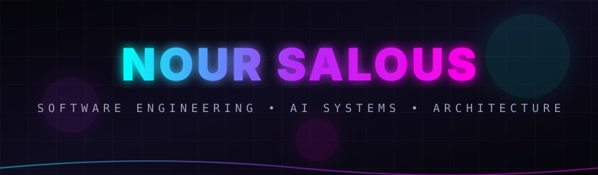
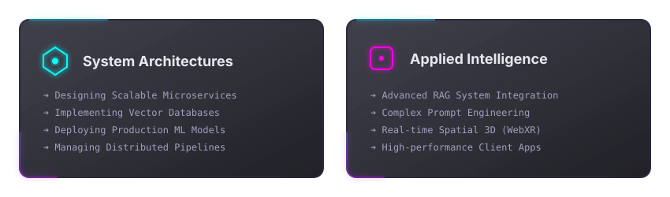

 

### About Me

Full-stack engineer building at the intersection of **modern web architecture** and **applied AI/ML**. I ship end-to-end — from React and Angular frontends through Node and NestJS backends to vectorized databases — and I turn ML research into production software. Currently co-founding an AI study platform, building AR-web experiences, and publishing EEG-based ML research.

<h3>Currently</h3>

<h3>Featured Projects</h3>

### Tech Stack

**Languages**

**Frontend**

**Backend**

**Database**

**AI / ML**

**Tools**

  
  

  

  &#160;&#160;
  &#160;&#160;
  

 

  <i>Designed for dark mode &#183; Built with SVG animation &#183; Nour Salous</i>

