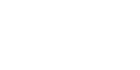

  

  
    
  
  &nbsp;
  
  &nbsp;
  

 

 

  

 

 

<h2 align="center">🔍 ABOUT</h2>

<table border="0" width="100%" cellpadding="15">
  <tr>
    <td align="center">
      

        Software Engineer specializing in <strong>Full-Stack Architecture</strong>, <strong>Applied AI</strong>, and <strong>ML Systems</strong>. Building scalable React/Node.js solutions with a track record of driving complex projects end-to-end — from architecting an AI study platform (<strong>RAG, NestJS, pgvector</strong>) to co-authoring <strong>EEG-based ML research</strong>. Adept at bridging product vision with technical execution across full-stack and 3D web environments.
      

    </td>
  </tr>
</table>

 

 

<h2 align="center">💼 EXPERIENCE</h2>

<table border="0" width="100%" cellpadding="12">
  <tr>
    <td width="33%" valign="top" align="center">
      
        
      

        Sole developer for <strong>Auth &amp; AR-web platform</strong> — React, Node.js/Express, MongoDB, JWT, Three.js, WebXR. Shipped metatip3d.com.tr.
      

    </td>
    <td width="33%" valign="top" align="center">
      
        
      

        AI research in multidisciplinary medical lab applying AI to clinical problems alongside faculty and international researchers.
      

    </td>
    <td width="33%" valign="top" align="center">
      
        
      

        Responsive commercial website — HTML5, CSS3, JavaScript. <strong>Cross-browser optimization</strong> and performance tuning.
      

    </td>
  </tr>
</table>

 

 

<h2 align="center">🚀 FEATURED PROJECTS</h2>

<table border="0" width="100%" cellpadding="12">
  <tr>
    <td width="25%" align="center" valign="top">
      
      
AI study platform — transcription, flashcards, mind-maps, spaced repetition, RAG assistant. Full-stack co-founder.

       
      
      
      
      
      
      
    </td>
    <td width="25%" align="center" valign="top">
      
      
Sole-developed auth &amp; authorization portal with multi-stage JWT security and CI/CD deployment.

       
      
      
      
      
    </td>
    <td width="25%" align="center" valign="top">
      
      
3D anatomy explorer with raycasting-based systems, delivered as cross-platform AR (GLB).

       
      
      
      
      
    </td>
    <td width="25%" align="center" valign="top">
      
      
ML study classifying ADHD from EEG (77 subjects). SVM, GMM, RF, XGBoost — up to <strong>84.4% sensitivity</strong>.

       
      
      
      
      
    </td>
  </tr>
</table>

 

 

  

 

 

<h2 align="center">⚙️ TECH STACK</h2>

<table border="0" width="100%" cellpadding="10">
  <tr>
    <td width="18%"><strong>🖥️ Languages</strong></td>
    <td>
      
      
      
      
      
      
      
      
      
    </td>
  </tr>
  <tr>
    <td><strong>🎨 Frontend</strong></td>
    <td>
      
      
      
      
    </td>
  </tr>
  <tr>
    <td><strong>⚡ Backend</strong></td>
    <td>
      
      
      
      
      
    </td>
  </tr>
  <tr>
    <td><strong>🤖 AI &amp; ML</strong></td>
    <td>
      
      
      
      
      
    </td>
  </tr>
  <tr>
    <td><strong>🛠️ Tools</strong></td>
    <td>
      
      
      
      
      
    </td>
  </tr>
</table>

 

 

<h2 align="center">📊 METRICS</h2>

<table border="0" width="100%" cellpadding="10">
  <tr>
    <td align="center" width="50%">
      
    </td>
    <td align="center" width="50%">
      
    </td>
  </tr>
</table>
 
<table border="0" width="100%" cellpadding="10">
  <tr>
    <td align="center" width="50%">
      
    </td>
    <td align="center" width="50%">
      
    </td>
  </tr>
</table>

 

 

  <h2>Let's Connect</h2>
   
  
  &nbsp;&nbsp;
  
    
  

