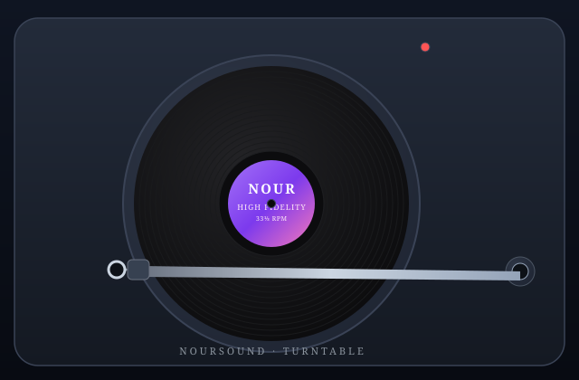

  

  
  
  

 

---

## 🎵 The Record Player — yes, it actually plays

GitHub READMEs can't run JavaScript, so I built the real thing as a live web app. **Grab the tonearm, drop it on the record — it starts spinning and the music plays.** Lift it to pause. All three tracks are synthesized live in your browser (zero audio files, zero dependencies).

<table>
  <tr>
    <td align="center">
      <a href="https://noursalous.github.io/">
        
         
        <b>🎵 Drop the needle & play</b>
         
        Drag the tonearm onto the record · or just click the platter · Space toggles
      </a>
    </td>
    <td align="center" width="45%">
      <a href="https://noursalous.github.io/#arcade">
        
🕹️

        <b>🎮 The Arcade</b>
         
        Six playable mini-games, right in my profile:
          
        🐍 <b>Snake</b> · 🧠 <b>Memory Match</b> 
        ✊ <b>RPS vs Mentara AI</b> · 🐭 <b>Whack-a-Mole</b> 
        ⭕ <b>Tic-Tac-Toe</b> (unbeatable AI) · 🎯 <b>Guess the Number</b>
          
        Play the arcade →
      </a>
    </td>
  </tr>
</table>

  Source lives in <code>playground/index.html</code>, deployed to <a href="https://noursalous.github.io/">noursalous.github.io</a> by GitHub Actions.

---

## 🎲 Click-to-Play Mini Games (inside the README!)

JavaScript isn't allowed here, so these are pure-HTML games. Click to expand, click to play.

  
<b>🎲 Riddle me this</b>

   
  

    
<b>1.</b> The more you take, the more you leave behind. What am I?

    <b>Footsteps.</b> 👣
  

  

    
<b>2.</b> I speak without a mouth and hear without ears. What am I?

    <b>An echo.</b> 🔊
  

  

    
<b>3.</b> I have cities, but no houses; forests, but no trees; and water, but no fish. What am I?

    <b>A map.</b> 🗺️
  

  
<b>🎯 Guess the Dev</b> — do you actually know me?

   
  

    
<b>Q1.</b> What GPA did I graduate with?

    <b>3.94 / 4.00</b> — honor student. 🎓
  

  

    
<b>Q2.</b> What's the name of the AI study platform I co-founded?

    <b>Mentara</b> — transcription, AI flashcards, RAG assistant. 🧠
  

  

    
<b>Q3.</b> Which ML model classifies ADHD from EEG data in my research?

    <b>Random Forest & XGBoost</b> (up to 84.4% sensitivity). 📊
  

  

    
<b>Q4.</b> What 3D anatomy platform did I architect?

    <b>MetaTıp 3D</b> — AR-web anatomy explorer. 🦴
  

  

    
<b>Q5.</b> How many languages do I speak?

    <b>Three</b> — English, Arabic, Turkish. 🌍
  

  
<b>🎯 Number Guesser</b> — pick a number, I'll read your mind

   
  

    
Pick a number between <b>1 and 10</b>

    

      
Multiply it by <b>2</b>

      

        
Add <b>8</b>

        

          
Divide by <b>2</b>

          

            
Subtract your <b>original number</b>…

            <b>…and you got 4.</b> 🤯 (It's algebra — (2n+8)/2 − n = 4.)
          

        

      

    

  

  
<b>🗺️ Choose Your Own Adventure</b> — a 30-second quest

   
  

    
🔦 You find a mysterious terminal with <code>noursound --play</code> running…

    

      
💻 Type <code>cat README.md</code>

      <b>You are here.</b> This README is the adventure. Loop forever. 🔁
    

    

      
🎧 Press Enter and listen

      <b>You earn the "Record Player" ending.</b> → <a href="https://noursalous.github.io/">Go play it!</a> 🎵
    

    

      
🎮 Type <code>games</code>

      <b>You earn the "Arcade King" ending.</b> → <a href="https://noursalous.github.io/#arcade">Play all six!</a> 🎮
    

    

      
🚀 Type <code>sudo deploy</code>

      <b>You earn the "CI/CD Champion" ending.</b> The playground ships to GitHub Pages. ⚡
    

  

---

## 👨‍💻 About Me

I'm a high-achieving Software Engineer and honor graduate (GPA **3.94/4.00**) specializing in **Full-Stack Architecture, Applied AI, and ML Systems**. I drive complex projects end-to-end — from architecting an AI study platform (RAG, NestJS, pgvector) to co-authoring EEG-based ML research — and I love bridging product vision with technical execution across full-stack and 3D web environments.

| | |
|---|---|
| 🎓 | **B.Sc. Software Engineering**, Uskudar University (Jul 2026) — Honor Student |
| 🏅 | **3rd Place** — Üsküdar University Engineering & Natural Sciences Student Congress (Medical AI Research) |
| 🗣️ | English · Arabic · Turkish |
| 📍 | Istanbul, Turkey |

---

## 🛠️ Tech Stack & Arsenal

  

**AI/ML:** OpenAI API · DeepSeek · RAG Pipelines · scikit-learn · Prompt Engineering · pgvector
**Game & AR:** Unity 3D · WebAR/WebXR · Three.js
**Tools:** Docker · Git/GitHub · n8n · Figma · Blender

---

## 🚀 Featured Projects

| Project | What it is | Stack |
|---|---|---|
| **[Mentara](https://mentara.online)** | Co-founded AI-powered all-in-one study platform — transcription, AI flashcards/quizzes, mind-mapping, spaced repetition, RAG assistant | Angular · NestJS · PostgreSQL (pgvector) · n8n · DeepSeek/OpenAI/Whisper |
| **[MetaTıp 3D](https://metatip3d.com.tr)** | Interactive 3D anatomy explorer + AR-web platform with multi-stage JWT security | React · Node.js/Express · MongoDB · Three.js |
| **ADHD from EEG (research)** | Co-authored ML study classifying ADHD in children (77 subjects, ~1,260 features) — hyperparameter-tuned Random Forest & XGBoost, SHAP, LOOCV | Python · scikit-learn |
| **EduLearn (Agile/Scrum)** | Led 8-person team as Product Owner for an AI-driven learning platform | Figma · Agile |
| **ApexGift** | AI recommendation engine that beats gift-giving anxiety | OpenAI API · prompt engineering |
| **Uskudar Extreme** | Immersive 3D university campus game | Unity/C# · navmesh AI |
| **Goldstream Banking** | End-to-end bank management system, sole developer | Java · SQL · JDBC |
| **FleetFreight** | Normalized SQL schema for a cargo logistics system | SQL · ER modeling |

---

## 💼 Experience

- **Software Engineer (Part-Time)** — MetaTıp · sole architect of the Auth portal, the AR-web platform, and an interactive 3D anatomy explorer (raycasting-based), presented live at Teknofest 2025.
- **Research Assistant** — MIRAI Lab, Üsküdar University · applied AI to medical problems alongside faculty and international researchers.
- **Software Engineering Intern** — MetaTıp · prototyped 3D anatomical navigation, optimized Blender assets (−40% file size, −38% load time).
- **Freelance Web Developer** — Dealtam · responsive commercial site in HTML5/CSS3/JS with cross-browser polish.

---

## 🎵 Now Playing

  

---

## 🐍 GitHub Activity Animation

  <picture>
    <source media="(prefers-color-scheme: dark)" srcset="https://raw.githubusercontent.com/NourSalous/NourSalous/output/github-contribution-grid-snake-dark.svg">
    <source media="(prefers-color-scheme: light)" srcset="https://raw.githubusercontent.com/NourSalous/NourSalous/output/github-contribution-grid-snake.svg">
    
  </picture>

---

## 📊 GitHub Stats

  
  

 

  

---

## 📫 Let's Connect

  
  
  

