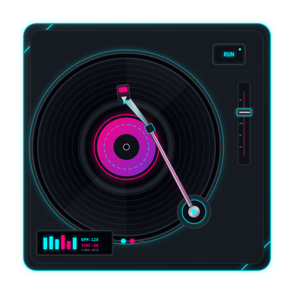

  <table border="0" width="100%" cellpadding="15">
    <tr>
      <td width="70%" align="center">
        
         
        
        <i>"Code quality is measured with WTFs per min during code review"</i>
      </td>
      <td width="30%" align="center">
        <!-- Animated Vinyl Player linking to the live playground -->
        
      </td>
    </tr>
  </table>

 

 

  <h2>About Me</h2>

  <table border="0" width="90%" cellpadding="20">
    <tr>
      <td align="center">
        

          Full-stack software engineer specializing in <strong>3D web graphics</strong> (Three.js/Blender/model-viewer), <strong>modular AI systems & pipelines</strong>, and clean <strong>security infrastructure</strong>. I build highly optimized, secure, and visually immersive experiences for the modern web.
        

      </td>
    </tr>
  </table>

 

 

  <h2>Professional Experience & High-Impact Projects</h2>

 

<table border="0" width="100%" cellpadding="15">
  <tr>
    <td width="33%" align="center" valign="top">
      <h2>Mentara</h2>
      
Web-based AI learning platform featuring automated lecture-to-study pipelines.

      
      
      
    </td>
    <td width="33%" align="center" valign="top">
      <h2>Metatıp Auth</h2>
      
Independently engineered complete authentication and authorization security engine.

      
      
      
    </td>
    <td width="33%" align="center" valign="top">
      <h2>3D Web & AR</h2>
      
High-performance graphics, mesh segmentation, coordinate tracking & USDZ.

      
      
      
    </td>
  </tr>
</table>

 

 

  <h2>Tech Stack</h2>

 

<table border="0" width="100%" cellpadding="10">
  <tr>
    <td width="20%"><strong>Languages</strong></td>
    <td>
       
       
       
       
       
      
    </td>
  </tr>
  <tr>
    <td><strong>Frontend</strong></td>
    <td>
       
       
       
      
    </td>
  </tr>
  <tr>
    <td><strong>Backend</strong></td>
    <td>
       
       
       
      
    </td>
  </tr>
  <tr>
    <td><strong>AI & Automation</strong></td>
    <td>
       
       
       
      
    </td>
  </tr>
  <tr>
    <td><strong>Tools</strong></td>
    <td>
       
       
       
      
    </td>
  </tr>
</table>

 

 

  <h2>Activity & Metrics</h2>

 

  <table border="0" width="100%">
    <tr>
      <td align="center" width="50%">
        <!-- Live GitHub Stats with Neon Cyan and Magenta -->
        
      </td>
      <td align="center" width="50%">
        <!-- Live GitHub Streak Stats -->
        
      </td>
    </tr>
  </table>
   
  <!-- Top Languages Card -->
  

 

 

  <h2>Let's Connect</h2>
    
  
  &nbsp;&nbsp;
  

