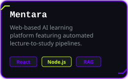
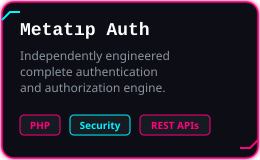
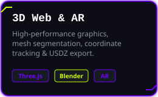
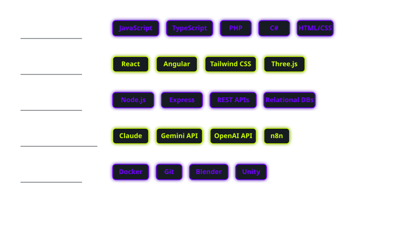

<div align="center">
  <table border="0" width="100%" cellpadding="15">
    <tr>
      <!-- Left: Avatar -->
      <td width="20%" align="center">
        
      </td>
      <!-- Center: Name & Quote -->
      <td width="50%" align="center">
        
        <br/>
        <sub><i>"Code quality is measured with WTFs per min during code review"</i></sub>
      </td>
      <!-- Right: Vinyl -->
      <td width="30%" align="center">
        <a href="https://noursalous.github.io/NourSalous/playground/" title="Click to play my interactive vinyl!">
          
        </a>
      </td>
    </tr>
  </table>
</div>

<br/>

<br/>

<div align="center">
  <h2>About Me</h2>
</div>

```bash
root@noursystem:~# ./init_profile.sh
> loading core_modules... [OK]
> bypassing security protocols... [OK]

Full-stack software engineer specializing in 3D web graphics 
(Three.js/Blender/model-viewer), modular AI systems & pipelines, 
and clean security infrastructure. 

I build highly optimized, secure, and visually immersive 
experiences for the modern web.
```

<br/>

<br/>

<div align="center">
  <h2>Professional Experience & Big Projects</h2>
  <br/>
  <table border="0" width="100%" cellpadding="5">
    <tr>
      <td width="33%" align="center">
        
      </td>
      <td width="33%" align="center">
        
      </td>
      <td width="33%" align="center">
        
      </td>
    </tr>
  </table>
</div>

<br/>

<br/>

<div align="center">
  <h2>Tech Stack</h2>
  <br/>
  
</div>

<br/>

<br/>

<div align="center">
  <h2>Activity & Metrics</h2>
  <br/>
  
</div>

<br/>

<br/>

<div align="center">
  <h2>Let's Connect</h2>
  <br/><br/>
  <a href="https://github.com/NourSalous">
    
  </a>
  &nbsp;&nbsp;&nbsp;&nbsp;
  <a href="mailto:noorsalous2000@gmail.com">
    
  </a>
</div>
