<!-- ============================================================
     NOUR SALOUS — PROFILE README
     Optimized for dark-mode viewing (neon accents on #0a0a12).
     ============================================================ -->

<!-- Header banner -->

 

<!-- Animated typing subtitle -->

 

<!-- Divider -->

## ✦ About Me

Full-stack engineer & **honors graduate** (GPA 3.94/4.00) combining the strongest JS ecosystems with **applied AI/ML**. I architect products end-to-end — from **React / Angular** frontends to **Node / NestJS** backends and **vectorized** databases — and I turn ML research into shipping software.

Currently building **React/Node** solutions, heading an **AI-powered study platform** (RAG + pgvector), and co-authoring **EEG-based ML research**. I care about clean architecture, measurable impact, and interfaces that feel alive.

---

## ✦ Currently

<table>
  <tr>
    <td align="center"><b>🔭 Building</b> <a href="https://mentara.online"><b>Mentara</b></a> <i>AI-powered all-in-one study platform</i> Angular · NestJS · PostgreSQL + pgvector · RAG assistant</td>
    <td align="center"><b>💼 Software Engineer</b> Part-time at <b>MetaTıp</b> <i>AR-web platform</i> <a href="https://metatip3d.com.tr">metatip3d.com.tr</a></td>
  </tr>
  <tr>
    <td align="center"><b>🔬 Research Assistant</b> <b>MIRAI Lab</b> <i>Medical Innovation Research in AI Lab</i> Üsküdar University</td>
    <td align="center"><b>🎓 B.Sc. Software Engineering</b> Üsküdar University · Honors <i>Class of Jul 2026 · GPA 3.94/4.00</i></td>
  </tr>
</table>

---

## ✦ Featured Projects

| 🧠 **Mentara** · <a href="https://mentara.online">mentara.online</a> | 🔬 **EEG-Based ADHD Detection in Children** |
|---|---|
| RAG-based AI study platform that turns lectures into flashcards, quizzes & an answerable AI assistant. | ML research detecting ADHD via EEG — SVM, GMM, Random Forest, XGBoost + SHAP. **84.4% sensitivity**. |
| `Angular` · `NestJS` · `PostgreSQL (pgvector)` · `RAG` | `Python` · `scikit-learn` · `ML` · `SHAP` |

| 🦴 **MetaTıp AR-Web Platform** · <a href="https://metatip3d.com.tr">live</a> | 🎮 **3D University Campus Game** |
|---|---|
| 3D anatomy explorer with AR / WebXR interfaces for medical learning. | "Uskudar Extreme" campus exploration game. |
| `Three.js` · `React` · `WebXR` · `AR` | `Unity` · `C#` · `3D` |

| 🎁 **ApexGift** | |
|---|---|
| AI-driven gift recommendation engine powered by OpenAI APIs. |
| `OpenAI API` · `Prompt Engineering` |

---

## ✦ Tech Stack

**Languages**

**Frontend**

**Backend**

**Database**

**AI / ML**

**Tools**

---

## ✦ GitHub Stats

  
  

  

---

## ✦ Connect

  
  
  
  

  <i>Building at the intersection of full-stack web & applied AI · Optimized for dark mode ✦</i>

